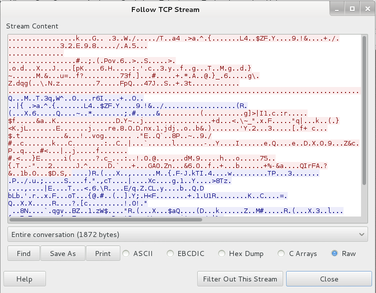

# Introduction

## Differences between Clear Text, Cryptography Protocols & VPNs

Clear-text:

* Easy to intercept, eavesdrop & mangle.
* Use clear-text only on trusted networks.

Cryptographic Protocols:

* Protocol encrypts information transmitted to protect the communication.
* Prevents eavesdropping.
* Need to transmit clear-text anyways? Wrap your communication into a **tunnel**.
* Protocol for Tunneling = VPN.

VPN:

* A VPN uses cryptography to extend a private network over a public one.
* Protected connection a to a a private network.
* A VPN connection is needed for using the course Labs.

## HTTP(s) Traffic Sniffing with Wireshark

There are **2** websites using **HTTP** and **HTTPS** respectively, differences in the communication can be checked through a sniffer as Wireshark and using the command 'Follow TCP Stream':

 

## Basic Binary and Hexadecimal Arithmetic

### Binary

> `1 + 1 = 10`
>
> `111 + 1 = 1000`
>
> `1101b` = `13d`

### **Converting Decimal and to Binary**

Divide by 2 and keep a not of the remainder iterating the same operation until the dividend is zero.

`13d` is `1011b`:

| Step | Operation  | Remainder |
| ---- | ---------- | --------: |
| 1    | 13 / 2 = 6 |         1 |
| 2    | 6 / 2 = 3  |         0 |
| 3    | 2 / 2 = 1  |         1 |
| 4    | 1 / 2 = 0  |         1 |

### **Binary Operators**

| Name  | Description                                                    | Example                  |
| ----- | -------------------------------------------------------------- | ------------------------ |
| `NOT` | Negation                                                       | `NOT 1101` = `0010`      |
| `AND` | if (both bits in the comparing position are ones) -> 1; else 0 | `1001 AND 1100` = `1000` |
| `OR`  | if (at least one of the bits is one) -> 1; else 0              | `1001 OR 1100` = `1101`  |
| `XOR` | if (**just one** of the bits is one) -> 1; else 0              | `1001 XOR 1100` = `0101` |

### Hexadecimal

|     |   |   |   |   |   |   |   |   |   |   |    |    |    |    |    |    |
| --- | - | - | - | - | - | - | - | - | - | - | -- | -- | -- | -- | -- | -- |
| Hex | 0 | 1 | 2 | 3 | 4 | 5 | 6 | 7 | 8 | 9 | A  | B  | C  | D  | E  | F  |
| Dec | 0 | 1 | 2 | 3 | 4 | 5 | 6 | 7 | 8 | 9 | 10 | 11 | 12 | 13 | 14 | 15 |

`0x3a1` = `3a1h` = `929d`

| Conversion | Operation  | Total |
| ---------- | ---------- | ----: |
| 3 = 3      | 3 \* 16^2  |   768 |
| a = 10     | 10 \* 16^1 |   160 |
| 1 = 1      | 1 \* 16^0  |     1 |

### **Converting decimal to hexadecimal**

Similar to converting decimal to binary: `1019d` = `0x3FB`

| Number/16 | Result  | Reminder \* 16        |
| --------- | ------- | --------------------- |
| 1019 / 16 | 63.6875 | 0.6875 \* 16 = 11 (B) |
| 63 / 16   | 3.9375  | 0.9375 \* 16 = 15 (F) |
| 3 / 16    | 0.1875  | 0.1875 \* 16 = 3      |
| 0 / 16    | --      |                       |
