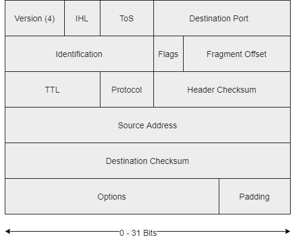
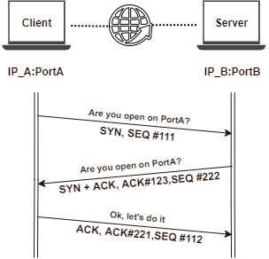

# Networking

## Protocols

IP protocol header is 160bits (20Bytes):

* First 4 bits: IP version.
* Source Address: 32 bits (starting at position 96).
* Destination Address: just right after.



### Protocol Layers

* During **encapsulation**, every protocol adds its own header to the packet, treating it as a payload.
* The receiving host does the same operation in reverse order. Using this method, the application does not need to worry about how the transport, network and link layers work. It just hands in the packet to the transport layer.

|                            TCP/IP                            |                                                ISO/OSI                                                |
| :----------------------------------------------------------: | :---------------------------------------------------------------------------------------------------: |
| <p>Application <br> Transport <br> Network <br> Physical</p> | <p>Application <br> Presentation <br> Session <br> Transport <br> Network <br> Link <br> Physical</p> |

### IPv4

* Internet Protocol is the protocol that runs on the Internet layer of the Internet Protocol Suite, also known as TCP/IP.
* IP delivers datagrams (IP packets) to rest of hosts, using IP addresses to identify them.
* IPv4 addresses = 4 bytes.
* To fully identify a host, you also need to know its network: IP address + Subnet Mask.
* To fully identify the network part you have to perform a bitwise AND operation between the netmask and the IP address.

| Reserved IPv4 addresses       | Purpose          |
| ----------------------------- | ---------------- |
| 0.0.0.0 - 0.255.255.255       | This network     |
| 127.0.0.0 - 127.255.255.255   | Local host       |
| 192.168.0.0 - 192.168.255.255 | Private Networks |

Example:

|                               | Decimal           | Binary                              |
| ----------------------------- | ----------------- | ----------------------------------- |
| Host IP Address               | 192.168.33.12     | 11000000.10101000.00100001.00001100 |
| Mask                          | 255.255.224.0     | 11111111.11111111.11100000.00000000 |
| **Network**                   | 192.168.32.0(/19) | 11000000.10101000.00100000.00000000 |
| NOT Mask                      | 255.255.224.0     | 00000000.00000000.00011111.11111111 |
| Host Part 'IP' AND 'NOT Mask' | 0.0.1.12          | 00000000.00000000.00000001.00001100 |

> 13 bits to represent hosts => 2^13 = **8192** different addresses - 2 (network and broadcast)
>
> * **Network**: one with the host part made by all zeros
> * **Broadcast**: another with the host part made by all ones

### IPv6

* 16bit hexadecimal numbers separated by a colon (:).
* Regular Form: `2001:0db8:0020:130F:0000:0000:097C:130B`.
* Compressed Form: `FF01:0:0:0:0:0:0:43` => `FF01::43`.
* IP v4-compatible: `0:0:0:0:0:0:13.1.68.3` => `::13.1.68.3`.
* Reserved addresses:
  * Loopback: `::1/128`.
  * IPv4 mapped addresses: `::FFFF:0:0/96`.
* IPv6 addresses can be split in half (64bits/each part).
  * _Network part_: Last 16 bits can be used only for specifying a subnet.
  * _Device part_: or Interface ID.
* IPv6 Scope
  * _Global Unicast Address_: scope internet - routed on internet
  * _Unique Local_: scope internal network or VPN - internally routable but not routed on Internet
  * _Link Local_: scope network link - not routed internally nor externally

IPv6 Subnetting:

|                  Prefix (First 64 bits)                 |    Host (Last 64)   |
| :-----------------------------------------------------: | :-----------------: |
| Internet Global Addressing (48bits) + Subnets (16 bits) | Device/Interface ID |

## Routing

**Routers** are devices connected to different networks at the same time, forwarding IP datagrams from one network to another.

* Routing protocols are used to determine the best path to reach a network. They behave like a postman who tries to use the shortest path possible to deliver a letter.
* A router inspects the destination address of every incoming packet and then forwards it through one of its interfaces.

Routing Table:

* To choose the right forwarding interface, a router performs a lookup in the routing table, where it finds an IP-to-interface binding.
* The table can also contain an entry with the default address (0.0.0.0). This entry is used when the router receives a packet whose destination is an _unknown network_.

Metrics:

* Routing protocols also assign a metric to each link.
* This ensures that, if two paths have the same number of hops, the fastest route is selected.
* The metric is selected according to the channel's estimated bandwidth and congestion.

Checking the routing table:

| OS       | Command       |
| -------- | ------------- |
| Linux    | `ip route`    |
| Windows  | `route print` |
| Mac OS X | `netstat -r`  |

## Hubs/Switches & Protocols

* Hubs/Switches are network devices that forward frames on a local network.
* They work with link layer network addresses: **MAC addresses**.
* Link layer protocols and devices only deal with the next hop.

### MAC addresses

* Uniquely identify a network card on the Layer 2.
* It's also known as physical address.
* 48 bits = 6 bytes, expressed in hexadecimal (Ex: `00:11:AA:22:EE:FF`).
* Every host has a MAC and an IP address.

Discovery of MAC addresses:

| OS             | Command         |
| -------------- | --------------- |
| Windows        | `ipconfig /all` |
| \*nix/Mac OS X | `ipconfig`      |
| Linux          | `ip addr`       |

### **Communication between Workstation A and Workstation B via a Router**

* The router will not change the source and destination IP addresses.
* Whenever a _device sends a packet_:
  * `Destination MAC address = MAC address of the next hop` (this ensures the network knows where to forward the packet).
  * `Destination IP address = Destination Host address` (this is global info and remains the same along the packet trip).
* Broadcast MAC address: `FF:FF:FF:FF:FF:FF` (a frame with this address is delivered to all the hosts in the local network).

| Field                   | `Workstation A` | `Router`        |
| ----------------------- | --------------- | --------------- |
| Destination IP address  | `Workstation B` | `Workstation B` |
| Destination MAC address | `Router`        | `Workstation B` |
| Source IP address       | `Workstation A` | `Workstation A` |
| Source MAC address      | `Workstation A` | `Router`        |

### **Hubs**

* Predecessor of switches, same purpose, different functionality.
* Repeaters and do not check any header.
* They simply forward packets by repeating same electric signals on every port.
* Every host receives the same packets.

### **Switches**

_Routers_ work with _IP addresses_. _Switches_ work with _MAC addresses_:

* They can have multiple interfaces.
* Different speeds: from 10Mbps to 10Gbps, being 1Gbps the standard.

### _CAM Table / Forwarding table_

Stored in the device's RAM.

* Binds MAC addresses to interfaces.
* Contains: MAC address, Interface & TTL.
* TTL determines how long an entry will stay in the table, CAM table has a finite size, as soon as an entry expires it is removed from the table.
* There might be multiple hosts on the same interface and interfaces without any host attached.
* Switches learn new MAC addresses dynamically, inspecting the header of every packet they receive, thus identifying new hosts.
* While routers use complex routing protocols to update their routing rules, switches just use the source MAC address of the packets they process to decide which interface to use when forwarding a packet.
* _CAM Table Population_, the source MAC address is compared to the CAM table:
  * If the _MAC address is not_ in the table, the switch will add a new _MAC-interface_ binding to the table.
  * If the _MAC is_ already in the table, its TTL gets updated.
  * If the _MAC is in the table but bound to another interface_, the switch will update the table.
* To **forward a packet**:
  * The switch reads the destination MAC address of the frame.
  * Performs a look-up in the CAM table.
  * It forwards the packet to the corresponding interface.
  * If there's no entry for that MAC address, the switch will forward the frame to all its interfaces.

Example of a CAM Table:

| MAC   | Interface | TTL | Description                                                         |
| ----- | --------- | --- | ------------------------------------------------------------------- |
| MAC#1 | 1         | 30  | A single host is attached to Interface 1.                           |
| MAC#2 | 2         | 5   | Two hosts are attached to Interface 2, probably via another switch. |
| MAC#3 | 2         | 5   | Two hosts are attached to Interface 2, probably via another switch. |
| MAC#4 | 3         | 7   | A single host is attached to Interface 3.                           |
|       |           |     | Interface 4 has no hosts attached.                                  |

**ARP: Host#A sends a packet Host#B**

`Host#A` needs to know IP/MAC addresses of `Host#B`. If `Host#A` knows `Host#B`'s IP but not MAC:

1. `Host#A` builds an ARP request containing the `Host#B`'s IP and `FF:FF:FF:FF:FF:FF` as destination MAC address.
2. Every host will receive the request. A host discards an entry at the power off or when the entry's TTL expires.
3. Only `Host#B` will ARP reply to it, telling `Host#A` its MAC address.
4. `Host#A` will save the IP-MAC binding in its ARP cache.

| OS             | Command  |
| -------------- | -------- |
| `arp -a`       | Windows  |
| `arp`          | \*nix OS |
| `ip neighbour` | Linux    |

## TCP & UDP & Ports

| TCP: Transmission Control Protocol   | UDP: User Datagram Protocol        |
| ------------------------------------ | ---------------------------------- |
| Guarantees packet delivery           | Does not guarantee packet delivery |
| Connection oriented                  | It's connectionless                |
| Vast majority of applications use it | Faster that TCP, better throughput |
| Lower throughput than UDP            | Multimedia applications            |

* `<IP>`:`<Port>`: identify a single network process on a machine.
* Server and Clients know what port to use as it's expressed in the source/destination ports in the TCP/UDP header.
* There are 1024 well-known ports: 0-1023.

|         |               |               |      |
| ------- | ------------- | ------------- | ---- |
| SMTP    | 25            | SFTP          | 115  |
| SSH     | 22            | Telnet        | 23   |
| POP3    | 110           | FTP           | 21   |
| IMAP    | 143           | RDP           | 3389 |
| HTTP    | 80            | MySQL         | 3306 |
| HTTPS   | 443           | MS SQL Server | 1433 |
| NetBIOS | 137, 138, 139 |               |      |

Check _listening ports_ and _current TCP connections_ as information about the processes listening on the machine and processes connecting to remote servers:

| OS       | Command                                                       |
| -------- | ------------------------------------------------------------- |
| Windows  | `netstat -ano`                                                |
| Linux    | `netstat -tunp`                                               |
| Mac OS X | `netstat -p tcp -p udp` together with `lsof -n -i4TCP -i4UDP` |

### TCP 3-way handshake



TCP is connection oriented. The header fields involved in the handshake are:

* Sequence number
* Acknowledgement numbers
* SYN & ACK flags
* Host -> SYN -> Server
  * SYN flag enabled
  * Random sequence number
* Host <- SYN-ACK <- Server
  * SYN & ACK flags enabled
  * Random sequence number
* Host -> ACK -> Server
  * Client completes the synchronization by sending an ACK packet

## Firewall & Network Defense

Firewalls functions:

* **Filter packets coming in and out of a network**:
  * Headers are inspected, but they don't give any information on the actual packet content.
  * Admin can crate rules according to certain characteristics: Source IP / Destination IP, Source Port / Destination Port, Protocol.
  * Packet inspection actions: Allow, Drop, Deny (same as drop but notifying the source host)
  * Packet filtering isn't enough to stop layer 7 attacks (application layer, as XSS, BoF, SQL injection or much more)
* **Access Control** to network resources and services (network 2 network too):
  * _NAT (Network Address Translations)_: rewrites source IP addresses of every packet.
  * _IP Masquerading_: masquerading the original client's IP address.
* Can **work on different layers of the OSI model**, filter unwanted traffic inspecting content (not just headers).

### IDS / Intrusion Detection Systems

* They inspect the application payload trying to detect any potential attack.
* They detect ongoing intrusions, attack vectors, ping sweeps, port scans, SQL injections, BoFs, etc.
* Can also identify traffic generated by a virus or worm by means of **signatures**.
* IDS cannot detect something _if it doesn't already know before hand_.
* _False positive_: legit traffic is flagged as malicious.
* Detection is performed by a multitude of sensors.
* IDS Manager: software is in charge of maintaining policies and providing a management console to the sysadmin.
* IDS **is not** a firewall substitute.

| 2 types       | Description                                                                                                                        |
| ------------- | ---------------------------------------------------------------------------------------------------------------------------------- |
| NIDS: network | <p>- Inspects network traffic with sensors <br> - Usually placed on a router or in a network with high intrusion risk (as DMZ)</p> |
| HIDS: host    | - Monitors app logs, file-system changes or OS changes                                                                             |

### IPS

* IDS can detect, activity is logged but the activity isn't blocked
* IPS drops malicious requests when a threat has a risk classification above a pre-define threshold

### Stop on Obstacle

When an environmental constraint (FW/IDS/other device) is in place:

* TCP SYN are sent, but there's no TCP SYN/ACK reply
* TCP SYN are sent, but a TCP RST/ACK is received

## LAB: Find the Secret Server

The is to configure your VPN lab environment in order to reach every webserver. Given you are connected through VPN to a target organization where:

* `10.175.34.0/24` is the VPN network for your PC.
* `172.16.88.81` is a webserver inside the `172.16.88.0/24` network.
* `192.168.241.12`  is a webserver inside the `192.168.241.0/24` network.
* `192.168.222.199`  is a webserver inside the `192.168.222.0/24` network.

Knowing the info above, we just need to add one more route in order to access the `192.168.222.0/24` network. We'll do that through our gateway `10.175.34.1`:

```bash
> ip route add 192.168.222.0/24 via 10.175.34.1
> route
Kernel IP routing table
Destination     Gateway         Genmask         Flags Metric Ref    Use Iface
default         liveboxfibra.ho 0.0.0.0         UG    100    0        0 eth0
10.175.34.0     0.0.0.0         255.255.255.0   U     0      0        0 tap0
172.16.88.0     10.175.34.1     255.255.255.0   UG    0      0        0 tap0
192.168.1.0     0.0.0.0         255.255.255.0   U     100    0        0 eth0
192.168.222.0   10.175.34.1     255.255.255.0   UG    0      0        0 tap0
192.168.241.0   10.175.34.1     255.255.255.0   UG    0      0        0 tap0
```

## DNS

* SSL/TLS certifications validation relies on DNS.
* DNS is an application layer protocol

Structure/Hierarchy of a DNS Name (www.sub.domain.com).

| Host | Subdomain | Domain Part | Top level domain |
| ---- | --------- | ----------- | ---------------- |
| www  | sub       | domain      | com              |

### DNS Resolution Algorithm

Resolvers are DNS servers provided by your ISP or publicly available: they convert a DNS name into an IP address.

1. The resolver contacts one of the root name servers, these serves contain information about the top-level domains.
2. It asks the TLD name server what's the name server that can give information (authoritative name server) about the domain the resolver is looking for.
3. If there are one or more subdomains, step 2 is performed again on the authoritative DNS server for every subdomain.
4. The resolver asks for the name resolution of the host part.

### Resolvers and Root servers

* IP addresses of the root servers are hardcoded in the configuration of the resolver.
* Sysadmins keep the list updated, otherwise, the resolver would not be able to contact a root server.

### Reverse DNS Resolution

* DNS can perform the inverse operation: convert an IP into a DNS name.
* The admin of a domain must enable this feature for a domain to make it work.
* `ping` utility performs a reverse DNS query after receiving every response from the target.

## Wireshark

* Can capture all the traffic seen by the network card of the computer running it.
* NIC (Network Interface Cards) need to work in promiscuous or monitor mode.
  * Instead of discarding any packet addressed to another NIC, in promiscuous mode a network card will accept and process **any** packet.
  * Just like it would happen in a hub network.
  * In switched networks, you have to perform an attack such as ARP poisoning or MAC flooding in order to do that.
  * WiFi medium is broadcast by nature.

### Some filters

* No ARP and no DNS: `not arp and !(udp.port == 53)`.
* Only ICMP: `icmp`.
* All HTTP GET request: `http.request.method == GET`.
* `tcp.stream eq 1`

### Be able to filter

* Filter one protocol
* Identify 3 way handshake
* Filter http traffic
* Filter ICMP
